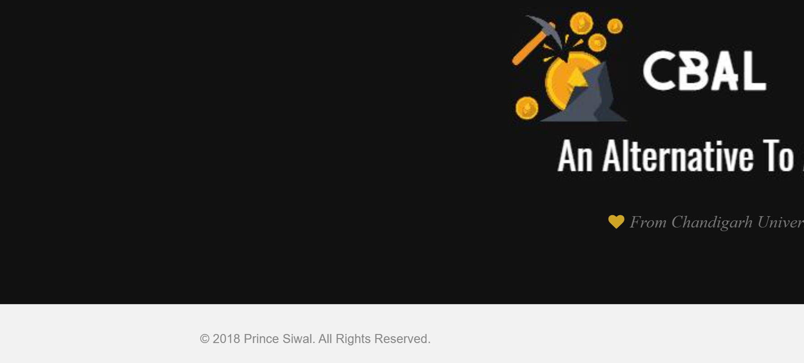
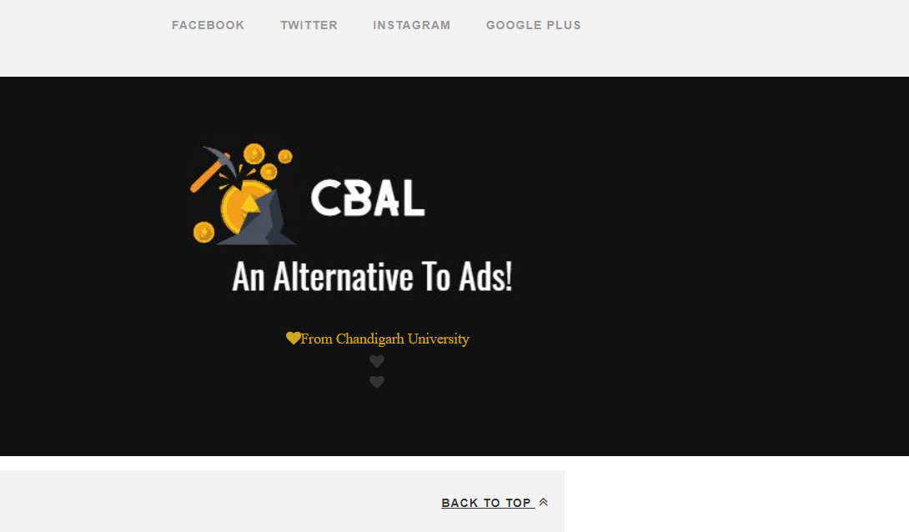

# CBAL-CryptocurrencyBasedADLimiter
AD limiter extension ,and corresponding website and demo videos 
you can see the hosted priview at http://cbal.000webhostapp.com/
This website provides the best user experience with attractive user interface and relavant web content. Bootstrap along with core css makes it mobile compatible. It has a well planned information structure. You will find that all the pages have a common navbar which is built using bootstrap using the class- " navbar navbar-fixed-top navbar-inverse ". The best part about the navigation bar is that it opens up to a different page every time the user clicks on the options he sees on the navigation bar placed on the top of the page. All the pages are really attractive. The website has a sticky top meaning the navigation bas doesn't disappear even when the user scrolls down the page. It was easily done by using - "navbar-fixed-top".  
The follwing page appears when the user clicks on extension option fromt the navigation bar - 

The logo of CBAL is a rock being broken with a hammer to gemerate money which is very similar to what this project is trying to do. It gives profit to the user who is surfing the website and the owner who is in need of more traffic. It simply uses the free CPU space of the user to generate traffic for the owner. The user in turn gets rid of all the advertisements. Also if you notice there is an amazing copyright at the bottom of each page which looks something like this -

Altogether there are five other html files that open up to different pages namely - "index.html" , "extension.html" , "guide.html" ,"about.html" and "contact.html" and these files are linked to the navigation bar. It was built using the hypertext reference tag of html which is the attribute of the anchor tag.This website has some cool features built especially for lazy people. the bottom of the page consist of a botton which the user can click and reach the top of the website again. Although this website is less complicated so scrolling is not required but a lazy person who doesn't like to scroll can always make use of this button. Have a look at this feature that might get removed as it is not useful just like the appendix that we all learnt in our primary school - if you remember - appendix ! 

